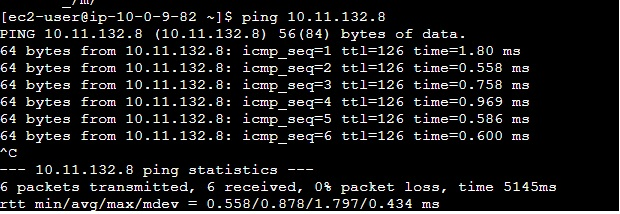

# communication-b-w-subnets

## communication using Transit Gateway

Transit Gateway to enable communication between a public instance in VPC A and a private instance in VPC B. The Transit Gateway acts as a central hub, allowing secure and efficient traffic flow between the VPCs.

## steps

1. Create a Transit Gateway
2. Attach VPCs to the Transit Gateway
3. Update VPC's Route Table
4. Configure Security Groups
5. Launch Instances
6. Testing and Verification

## Setup

### **Create a Transit Gateway**:

1. Open the AWS Management Console and navigate to the Amazon VPC service.
2. In the left navigation pane, click on "Transit Gateways" under "Transit Gateway" section.
3. Click on "Create Transit Gateway" and provide a name and optional tags for your Transit Gateway.
4. Choose the appropriate region and click on "Create Transit Gateway".

> No CIDR is required in transit gateway

### **Attach VPCs to the Transit Gateway**

1. Under "Transit Gateway Attachments" tab, click on "Create Transit Gateway Attachment".
2. Select "VPC" as the resource type.
3. Choose VPC A from the drop-down menu and select the appropriate subnet(s).
4. Repeat the same steps to attach VPC B to the Transit Gateway.

### **Update VPC's Route Table**

1. Go to the Amazon VPC service and select VPC A.
2. Click on "Route Tables" in the left navigation panel.
3. Select the route table associated with the public subnet.
4. Click on the "Routes" tab and then "Edit routes".
5. Add a new route with the destination set as the CIDR block of VPC B (e.g., 10.11.0.0/16) and the target set as the Transit Gateway.
6. Save the changes.
7. Repeat the same for another Route

> For VPC A you can use CIDR (e.g., 10.0.0.0/16)


### **Configure Security Groups**

1. In VPC A, go to the Amazon VPC service and select "Security Groups" in the left navigation pane.
2. Select the security group associated with the public instance.
3. Click on "Inbound Rules" and add a rule to allow inbound traffic from VPC B's CIDR block on the desired port(s) for communication with the public instance.
4. In VPC B, follow the same steps to configure the security group associated with the private instance, allowing inbound traffic from VPC A's CIDR block on the desired port(s).

> simply you can use all traffic and ipv4 Anywhere

### **Launch Instances**

1. Launch a public instance in VPC A by selecting the public subnet and assigning a public IP address.
2. Launch a private instance in VPC B by selecting the private subnet and ensuring that it does not have a public IP address.

### **Testing and Verification**

1. Connect to the public instance in VPC A using SSH/RDP.
2. Attempt to communicate with the private instance in VPC B using its private IP address.

    ```console
    $ ping <PrivateIPOfPrivateInstance>
    ```

3. If the connectivity is successful, you have implemented the Transit Gateway setup correctly.

